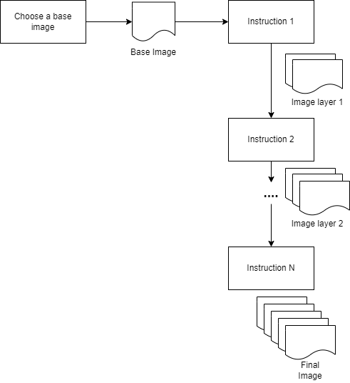

# Containers and Docker

## Overview

- [Containers and Docker](#containers-and-docker)
  - [Overview](#overview)
  - [What is a container?](#what-is-a-container)
  - [Why containers?](#why-containers)
    - [Application development](#application-development)
      - [without containers](#without-containers)
      - [with containers](#with-containers)
    - [Application deployment](#application-deployment)
      - [without containers](#without-containers-1)
      - [with containers](#with-containers-1)
  - [What is Docker?](#what-is-docker)
    - [Docker vs Virtual Machines](#docker-vs-virtual-machines)
    - [How does Docker work?](#how-does-docker-work)
  - [Container vs Image](#container-vs-image)
    - [Building Images with Dockerfiles](#building-images-with-dockerfiles)
      - [Image building workflow](#image-building-workflow)
  - [Using Docker](#using-docker)
    - [Pre-requisites](#pre-requisites)
  - [Building and Running an Image](#building-and-running-an-image)
    - [Commands Cheatsheet](#commands-cheatsheet)
  - [Further Information](#further-information)

## What is a container?

- A way to package an application with all necessary dependencies and configuration.
- That package is portable, easily shared and moved around.
- You can run code inside that package!

## Why containers?

**TLDR**: Containers allow you to reproduce runtime environments easily.

### Application development

#### without containers

- An application requires an environment to run on.
- An environment may contain many different dependencies for the application to run (such as node.js, postgres, sql, etc...)
- To share application among developers, they would also need to have installed the same dependencies to run on the same environment.
- Problems:
  - Installation process highly variable, especially if on different operating systems.
  - Many manual steps to install, and something could go wrong along the way.

#### with containers

- Each container is in it's own isolated environment, packaged with all configurations.
- One command to install the app.

### Application deployment

#### without containers

- Developers produce running artifacts for the application (`.jar` or `.js` file)
- Developers would create setup instructions or scripts to deploy a database for the application.
- Developers would send these instructions + running artifacts to an operations team to deploy.
- Problems:
  - Again, long instructions to configure servers lead to mistakes or problems.
  - Issues with dependency conflicts or versions.

#### with containers

- All dependencies are already packaged inside an application container.
- No environment configuration needed on server (only need docker runtime).
- Run docker commands to deploy application on the same environment.

## What is Docker?

**Docker** is an open platform for developing, shipping and deploying containers. It allows us to easily perform cool operations described above such as:

- Packaging and building all dependencies into a container.
- Running the same built container on any machine with docker installed.
- Easily share containers with other developers and machines.

### Docker vs Virtual Machines

Both virtual machines and docker provide a way to isolate environment for applications. What are the differences?


Source: https://www.docker.com/blog/containers-replacing-virtual-machines/

**Virtual Machines**

- Each application runs on it's own guest operating system.
- A _Hypervisor_ is used as a program to manage hardware resources between guest operating systems.

**Docker**

- All containerised applications run on the same host operating system.
- Benefits over Virtual Machines:
  - **Saves memory**: Each container is a lot smaller as compared to an entire OS.
  - **Saves time**: Building a container takes seconds, while an operating system may take ages to build.
  - **Caching**: Virtual machine snapshots are used sparingly, while docker uses images, which can be cached and built incrementally.

### How does Docker work?


Image taken from the official docker documentation site: https://docs.docker.com/get-started/overview/

- **Client**: Docker CLI, taking user input to run commands (eg: `docker run` or `docker pull`)
- **Docker Host**: Machine where the docker program is installed on. Could be your laptop or a virtual machine on the cloud.
- **Docker Daemon**: A running program that receives and runs docker commands from the client such as pulling images from a registry or to run a containers from a images.
- **Container**: An isolated environment for running an application.
- **Image**: A read only template on how to build and run a container.
- **Registry**: Server where docker images are stored. These is where the docker host would pull or push images to/from. There are private and public registries available depending on use cases.

## Container vs Image


- A container is a **running** **instance** of an image.
- An image is a **template** (i.e set of instructions) of how a container should build and run.
- We can have many containers **running** and a single **built** image.
  - (OOP analogy) Images -> Classes, Containers -> Objects.
- Docker **builds** from a `Dockerfile` or **pulls** *images* from a registry.  
- Docker **runs** *containers*.
- If it's not running, it is an image, if it is running it is a container.

### Building Images with Dockerfiles

#### Image building workflow

[Draw.io Link](https://viewer.diagrams.net/?tags=%7B%7D&highlight=0000ff&edit=_blank&layers=1&nav=1&title=test.drawio#R5VpNc5swEP01PibDt%2BEY20mbadpDfWhzlI0MpBgRWY5Nf32FkWyEwJCZYOTUk8yglZDE27dP0sLInK73XzBIw%2B%2FIh%2FHI0Pz9yJyNDEO3DGOU%2F2l%2BVljG5rgwBDjyWaOTYR79hcyoMes28uFGaEgQikmUisYlShK4JIINYIx2YrMVisVRUxBAyTBfgli2%2Fop8EjKr7niniq8wCkI2tGuw51sD3pg9ySYEPtqVTOb9yJxihEhxtd5PYZyDx3Ep7ntoqD1ODMOEdLlhhTfftJ%2BzmfP6kgWTNPDduXljsW42JONPDH0KACsiTEIUoATE9yfrBKNt4sO8W42WTm2eEEqpUafGF0hIxrwJtgRRU0jWMaulM8bZb3b%2FofCcF25tXpzty5WzjJVWKCGsU53iNynmnk%2B4ERP%2BfGiLl%2FAMEIymBOAAkjPtTPvoOsp5iNaQTpDeiGEMSPQmTgQw8gXHdif%2F0Avmone4i83yDcRbNtI0RGgD87Ho%2FwLkl05MH2CywPQqyK%2Bidc7xqptFJ%2B7CiMB5Cg4Y7Wgoiw5jw0JM4P481DIy7AbTZHHAhYAVd6Wo4qESlgLK0XrC0h2E%2Bj1SmEtmK4f1Bk9dhsN8miUSPyYbgrdLEqGEVsh%2BuTRXHVsxrjrGsDJ9UuZnQZgvLtM63wO0cdxwB%2BW43sJx2Z9Dc9woVrYhSW5KoH0yhS5I2YG99qDs5dMUHMF2FXxTwQ05WoKLnNct4hU3mwOOd7moe%2Bn%2BVMl7uaU%2F3hOdatGZOAA1lwat0IHSn4jeo0GG%2FsApihGmlgQlOSdWURxXTCCOgoQWl9SJkNoneTBFdN9%2FxyrWke8fCFUXiiLJPiIaXTEaTUOORqcmGM2%2BgtH02oMxoDCkjQ%2FPTmRgwZtr7wXF1ivLsHErozKuQcW1%2B0LFbkeFnvPS%2FNJHy%2B368KRtar4o2PS0qJMgryvBzrixGeFOJLN7g1MWmsnhCKM91p5Z1Aj3%2BgXiI72Tibi3sL03DbAG3nUqkxzgYd9%2BstLqHXqZddseD6%2FZjidqtuXKJPbqJLu3hUzOmagt2YUXZYAFFbjVyj9TxtNy%2ByKZrNni0eaHBO%2FQRxtLH%2FxoYw0fmeNKAk63Bo5M59o2U4UXlY1Mx5Ejs9hGaTHI6K6nLrX22bZUTT7iWypH9I9eEwKtHjSsvjzYYQG%2Fiojg3VSw1CxBgVwJ%2FCHDZ9wh%2FXRpjTa1bhrt9abRHdIASjGy8KKyGs3Pb2c0Wgb4s2l0k48Y6fk6pogoj%2BVc%2FnWGwFGUVRbhazuttYBtVPbcaqHtKpDkHWuVw5o38LHEkyVabQq6DVlERUjmddDP3klWET27476qP5Jdm855DQCrQjIVNu8Vsbdr0k6XJVmHrJNaJFN78%2B51SFhd%2BoRo17zDuyzJ5KyT4iRr%2BIJTFZLJOaCHKAH5ff%2FHS9Em%2F4ivrDPRDR%2F%2FmQQtnr7NPtSVvnA37%2F8B)




* A `Dockerfile` is used to define an image, consisting a list of instructions to build that image.

```Dockerfile
FROM node:12-alpine                     <------- Chosen base image

RUN apk add --no-cache python2 g++ make <---- Instruction 1
WORKDIR /app                            <---- Instruction 2
COPY . .                                <---- Instruction 3
RUN yarn install --production           <---- Final Instruction

CMD ["node", "src/index.js"]            <---- Final command for container to run
```

* Generally, a parent image is first chosen as a base (eg: [node:alpine](https://hub.docker.com/_/node)).
* Then, for each instruction in a `dockerfile`, a new image is built as a layer on top from the last instruction.
* Final image is built with N layers after N instructions.
* Whenever a failed instruction is retried, docker uses the image layer produced from the instruction before.

## Using Docker

### Pre-requisites

- [Installed Docker Desktop for mac](https://docs.docker.com/desktop/mac/install/)
- Verify your installation by running docker desktop and on a terminal: 
```bash
docker ps
```

## Building and Running an Image

1. In your code repository, create a new `Dockerfile`.
2. Source control the created `Dockerfile`.
3. Choose an `image_name` and run `docker build . -t <image_name>` to build the image.
4. Run `docker run <image_name> ` to run a container from built image in step 3.

### Commands Cheatsheet


**Source**: https://github.com/collabnix/dockerlabs/blob/master/docker/cheatsheet/README.md

## Further Information

- [Docker overview](https://docs.docker.com/get-started/overview)
- [Docker for beginners](https://www.youtube.com/watch?v=3c-iBn73dDE&ab_channel=TechWorldwithNana)
